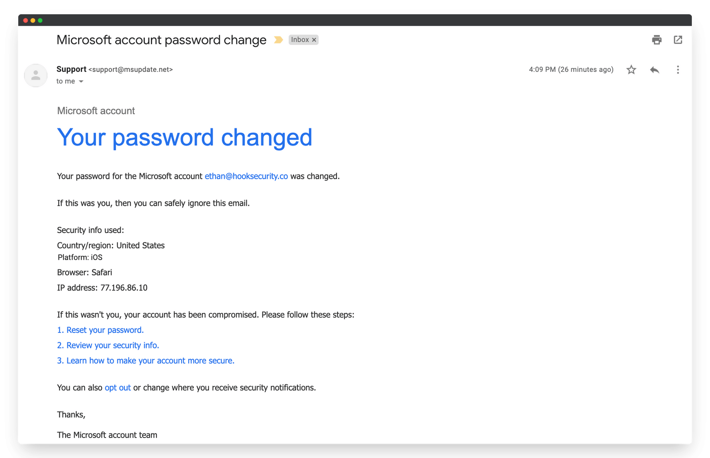

# Cybersecurity-Internship-Task-2
 Analysis of a Phishing Email Sample for the Elevate Labs Cyber Security Internship. 

**Student Name:** Sunil Pupalwad
**Task:** Task 2 - Analyze a Phishing Email Sample
**Objective:** To analyze a suspicious email sample and identify its phishing characteristics. 

---

## Email Sample Analyzed

Below is the screenshot of the phishing email sample that was analyzed for this task.

---

## Phishing Indicators Found

Based on the analysis of the provided email sample, the following phishing indicators were identified :

### 1. Sender's Email Address (Email Spoofing)
* **Observation:** The sender's email address is `support@msupdate.net`.
* **Analysis:** This is a major red flag. Official Microsoft communications come from legitimate domains like `@microsoft.com` or `@outlook.com`. The domain `msupdate.net` is a suspicious domain created to look official, which is a classic email spoofing technique. 

### 2. Urgent and Threatening Language (Social Engineering)
* **Observation:** The email subject is "Your password changed," and the body states, "If this wasn't you, your account has been compromised."
* **Analysis:** This language is designed to cause panic and a sense of urgency. The attacker wants the user to react emotionally and click the malicious links without thinking. This is a common social engineering tactic used in phishing. 

### 3. Suspicious Links
* **Observation:** The email contains several hyperlinks, such as "Reset your password," "Review your security info," and "Learn how to make your account more secure."
* **Analysis:** In a phishing email, these links do not lead to the legitimate Microsoft website. They are designed to redirect the user to a fake login page (phishing site) that will steal their credentials. 

### 4. Mismatched URLs (Potential)
* **Observation:** As this is a static image, I cannot hover over the links.
* **Analysis:** In a real-world scenario, hovering the mouse over the "Reset your password" link would be a critical step.  It would likely reveal a non-Microsoft URL (e.g., `http://verify-login.xyz` or a similar fake address) in the browser's bottom corner, confirming the link is malicious.

### 5. Irrelevant Information
* **Observation:** The email states, "Your password for the Microsoft account `ethan@hooksecurity.co` was changed."
* **Analysis:** This email was likely sent in a bulk campaign. If the recipient's email is not `ethan@hooksecurity.co`, this is a clear sign that the email is not legitimate and is a generic template sent to thousands of people.

###6. Grammar and Spelling

**Observation**: This particular email sample has relatively good spelling and grammar, which makes it more deceptive.

**Analysis**: While many phishing emails contain obvious errors, sophisticated ones like this are often well-written. A minor potential flag is the generic closing "The Microsoft account team," which can sometimes be a sign of a template.

Conclusion

This email is a clear example of a phishing attack. It combines a spoofed sender address with urgent social engineering language to trick the user into clicking malicious links. The ultimate goal is to steal the user's Microsoft account credentials by directing them to a fake login page.

---

## Email Header Analysis (Conceptual)

The task requirements specified using an "online header analyzer" . Since the provided sample was an image, it was not possible to extract the raw email headers for analysis.
However, if the headers were available, I would have used a tool like **MXToolbox** or **Google Admin Toolbox**  to:
* Check the `Authentication-Results` for `SPF`, `DKIM`, and `DMARC` failures.
* Examine the `Received` path to trace the email's origin and look for suspicious or unrelated servers.
* Verify the `Return-Path` and `Reply-To` fields to see if they matched the sender's domain or pointed to a different, malicious address.

---

## Tools & Methodology

1.  **Visual Analysis:** The primary analysis was done by visually inspecting the email screenshot (`phishing-sample.jpg`) for obvious phishing indicators as listed above.
2.  **Conceptual Header Analysis:** The methodology for using an **online header analyzer**  was understood and outlined, even if it could not be practically applied to the image sample.
3.  **GitHub:** The final report and sample image were organized and submitted in this GitHub repository as per the guidelines. 
